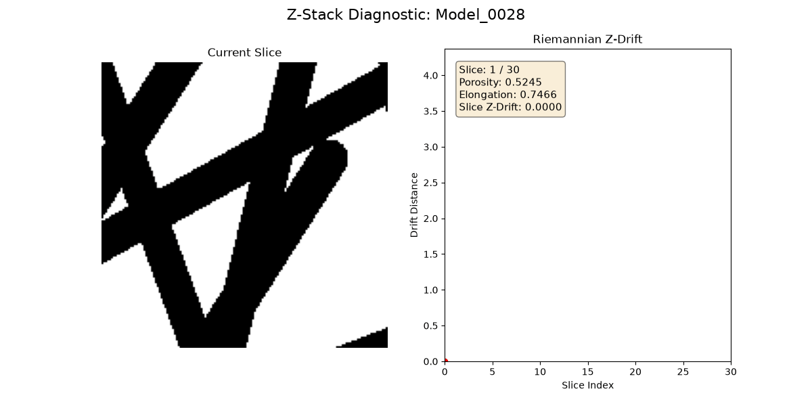

# Project Pandora Explained
### Authors: Amit Ghosh & Jack Rose



## Lens 1
- `lens1.py`:
  - Otsu acts as the binary mask, converting real images into `[1,0]`.
  - IoU and Dice will act as metrics for accuracy of Otsu's method.
  - `ptl_ccl` is the connected components class of an image.
    - It uses `area()` for calculating XY-variance and `eccentricity` for tortuosity.
  - `harris_corners` is used to to find sharp intersection points.
- `lens1_analysis.py`
  1. Loads the data into a `ptl_dataset`.
  2. Calculates the porosity (`p.sum(img > t) / img.size`) and compares it to `local_slice_porosity` using MSE.
  3. It uses elongation vs porosity to test how twister the flow is in the Z-axis ($\tau_z$).
  4. It utilizes Harris corner detection to count the number of sharp structural intersections, divide by the image area to get a "density" score, and see if it correlates with the actual physical thickness of the titanium/carbon fibers.

### Output:
```bash
rose0@fedora:~/Projects/Project_Pandora/CSE5524-Final-Project$ python lens1_analysis.py

[DEBUG] There are 1141 rows in PTL_CV_Dataset.xlsx
Processing dataset and extracting features...
[RESULT] Otsu's True 2D MSE: 4.947021368115722e-34
[RESULT] Elongation vs. Tortuosity (Z) Correlation: -0.0190
[RESULT] Junction Density vs. Fiber Radius Correlation: -0.6314

Exporting results to Excel...
[RESULT] Successfully saved to Lens1_Results.xlsx
```

Otsu's thresholding is exceptionally accurate at identifying the pores, proven by the near-zero mean squared error ($4.9 \times 10^{-34}$) against the dataset's ground truth porosity. However, while 2D pore elongation completely fails to predict 3D tortuosity ($-0.0190$), the Harris corner junction density proves to be a strong predictor for material structure, demonstrating that thinner fiber radii consistently generate significantly more physical intersections ($-0.6314$).

> **TODO:** We could use other methods besides Otsu's (watershed, Chan-Vese) and also run the pipeline with real images, so we can test IoU/Dice.

## Lens 2
> **WIP**

## Lens 3

- `lens3.py`:
  - For every pixel, it extracts `[x,y,I,Ix,Iy]` and calculates the covariance matrix.
  - We compares slices by using Riemann distance to see how far apart they are.
  - We extract the variance of those distances to see how much the porosity is fluctuating along the slices.
  - We then compare that to the actual porosity variance.

### Output:

```bash
rose0@fedora:~/Projects/Project_Pandora/CSE5524-Final-Project$ python lens3.py
[DEBUG] There are 1141 rows in PTL_CV_Dataset.xlsx
Running Lens 3 Covariance Tracking...
[Model_0001] Drift Variance: 0.0222 | Porosity Variance: 0.004824 | Label: Homogeneous
[Model_0002] Drift Variance: 0.0257 | Porosity Variance: 0.008596 | Label: Homogeneous
[Model_0003] Drift Variance: 0.0360 | Porosity Variance: 0.005772 | Label: Homogeneous
[Model_0004] Drift Variance: 0.0449 | Porosity Variance: 0.010442 | Label: Homogeneous
[Model_0005] Drift Variance: 0.0670 | Porosity Variance: 0.010141 | Label: Homogeneous
[Model_0006] Drift Variance: 0.0487 | Porosity Variance: 0.007929 | Label: Homogeneous
[Model_0007] Drift Variance: 0.2131 | Porosity Variance: 0.007577 | Label: Homogeneous
[Model_0008] Drift Variance: 0.2084 | Porosity Variance: 0.007075 | Label: Homogeneous
[Model_0009] Drift Variance: 0.0181 | Porosity Variance: 0.009175 | Label: Homogeneous
[Model_0010] Drift Variance: 0.0360 | Porosity Variance: 0.008922 | Label: Homogeneous
[Model_0011] Drift Variance: 0.0494 | Porosity Variance: 0.004738 | Label: Homogeneous
[Model_0012] Drift Variance: 0.1205 | Porosity Variance: 0.014392 | Label: Homogeneous
[Model_0013] Drift Variance: 0.0635 | Porosity Variance: 0.010136 | Label: Homogeneous
[Model_0014] Drift Variance: 0.0560 | Porosity Variance: 0.007694 | Label: Homogeneous
[Model_0015] Drift Variance: 0.1092 | Porosity Variance: 0.007079 | Label: Homogeneous
/home/rose0/.local/lib/python3.14/site-packages/scipy/_lib/_util.py:1136: RuntimeWarning: logm result may be inaccurate, approximate err = 3.367981782420916e-13
  return f(*arrays, *other_args, **kwargs)
[Model_0016] Drift Variance: 0.8753 | Porosity Variance: 0.008729 | Label: Heterogeneous
[Model_0017] Drift Variance: 0.0641 | Porosity Variance: 0.014558 | Label: Homogeneous
[Model_0018] Drift Variance: 0.0516 | Porosity Variance: 0.007182 | Label: Homogeneous
[Model_0019] Drift Variance: 0.0461 | Porosity Variance: 0.012634 | Label: Homogeneous
[Model_0020] Drift Variance: 0.0661 | Porosity Variance: 0.011828 | Label: Homogeneous
[Model_0021] Drift Variance: 0.1539 | Porosity Variance: 0.023125 | Label: Homogeneous
[Model_0022] Drift Variance: 0.7635 | Porosity Variance: 0.021372 | Label: Heterogeneous
[Model_0023] Drift Variance: 0.0725 | Porosity Variance: 0.009124 | Label: Homogeneous
[Model_0024] Drift Variance: 0.0647 | Porosity Variance: 0.011796 | Label: Homogeneous
[Model_0025] Drift Variance: 0.0524 | Porosity Variance: 0.014684 | Label: Homogeneous
[Model_0026] Drift Variance: 0.1045 | Porosity Variance: 0.019189 | Label: Homogeneous
[Model_0027] Drift Variance: 0.0843 | Porosity Variance: 0.012072 | Label: Homogeneous
[Model_0028] Drift Variance: 0.6348 | Porosity Variance: 0.028977 | Label: Heterogeneous
[Model_0029] Drift Variance: 0.0975 | Porosity Variance: 0.011784 | Label: Homogeneous
[Model_0030] Drift Variance: 0.1349 | Porosity Variance: 0.010849 | Label: Homogeneous
[Model_0031] Drift Variance: 0.2068 | Porosity Variance: 0.009679 | Label: Homogeneous
[Model_0032] Drift Variance: 0.3918 | Porosity Variance: 0.007794 | Label: Homogeneous
[Model_0033] Drift Variance: 0.2988 | Porosity Variance: 0.041666 | Label: Homogeneous
[Model_0034] Drift Variance: 0.0985 | Porosity Variance: 0.022042 | Label: Homogeneous
[Model_0035] Drift Variance: 0.0781 | Porosity Variance: 0.029426 | Label: Homogeneous
[Model_0036] Drift Variance: 0.2628 | Porosity Variance: 0.057663 | Label: Homogeneous
[Model_0037] Drift Variance: 0.0497 | Porosity Variance: 0.012716 | Label: Homogeneous
[Model_0038] Drift Variance: 0.1216 | Porosity Variance: 0.049919 | Label: Homogeneous

--- LENS 3 VALIDATION RESULTS ---
Correlation between Covariance Drift and True Porosity Variance: 0.2350
Spearman Correlation: 0.3785
Would you like to save the drift to Excel? (y/n): n
Drift results not saved.
```

The Lens 3 covariance tracking effectively identified highly unstable PTL structures, correctly flagging three specific models (16, 22, and 28) as heterogeneous due to their extreme Z-axis drift variances. This standalone mathematical texture tracking achieved a baseline Spearman correlation of 0.3785, proving that slice-to-slice structural shifts offer moderate predictive power for true 3D porosity variance even before fusing it with your Lens 1 metrics.

- `lens3_analysis.py`:
  - Acts as the **unified diagnostic script**, combining the 2D geometric metrics from Lens 1 and the Z-axis texture tracking from Lens 3 into a single pipeline.
  - Extracts three key metrics for each physical model:
    - **Z-Axis Drift:** Variance of Riemannian distances between consecutive slices (Texture shifting).
    - **XY-Axis Variance:** Mean variance of connected component pore areas within the slices (Spatial spread).
    - **Tortuosity:** Mean pore elongation/eccentricity across the slices (Path complexity).
  - Calculates independent Pearson and Spearman correlations for both the Z-axis and XY-axis features against the actual ground truth porosity variance.
  - Uses `scipy.stats.rankdata` to convert the three metrics and the ground truth into rankings, eliminating scale differences and outliers.
  - Fits a Multiple Linear Regression model on the ranked features to generate a combined **3D diagnostic Spearman correlation**.
  - Extracts the regression coefficients (`reg.coef_`) to definitively determine the feature weights (showing which of the three metrics is driving the final prediction) and securely exports the unified dataset to `Unified_Lens3_Results.xlsx`.

### Output:

```bash
rose0@fedora:~/Projects/Project_Pandora/CSE5524-Final-Project$ python lens3_analysis.py
[DEBUG] Loading Dataset...
[DEBUG] There are 1141 rows in PTL_CV_Dataset.xlsx
[DEBUG] Running Unified Lens 1 & 3 Tracking...
/home/rose0/.local/lib/python3.14/site-packages/scipy/_lib/_util.py:1136: RuntimeWarning: logm result may be inaccurate, approximate err = 3.367981782420916e-13
  return f(*arrays, *other_args, **kwargs)

--- Z-Axis (Inter-slice Covariance Drift) ---
Pearson Correlation: 0.23500356544410245
Spearman Correlation: 0.37848779954043116

--- XY-Axis (Intra-slice Pore Area Variance) ---
Pearson Correlation: 0.06722289994582464
Spearman Correlation: 0.20144435933909616

--- Combined 3D Diagnostic (Z + XY + Tortuosity) ---
Spearman Correlation: 0.5704125177809388

--- Feature Weights ---
Z-Drift:    0.6136
XY-Var:     0.2709
Tortuosity: -0.7186

Would you like to save the unified results to Excel? (y/n): n
Results not saved.
```

By fusing 2D geometric metrics with Z-axis texture tracking, the combined diagnostic model significantly increases its predictive power, achieving a strong overall Spearman correlation of 0.5704 against the ground truth 3D porosity variance. The regression weights reveal that while high slice-to-slice structural drift strongly indicates material instability, highly elongated continuous pores (high tortuosity) act as a dominant stabilizing factor for the overall physical volume.

# File tree:

```plaintext
CSE5524-Final-Project/
├── .git/                                # Git submodule pointer linking back to the parent Project_Pandora repository
├── .gitignore                           # Rules specifying which files (like caches or data) Git should ignore
├── __pycache__/                         # Compiled Python bytecode to make your imported scripts run faster
├── results/                             # Dedicated directory for storing generated visualizations or exports
├── main.py                              # The original entry point script from earlier in the project's development
├── lens1.py                             # Foundational 2D computer vision engine (Otsu, CCL, Harris Corners)
├── lens1_analysis.py                    # Validation pipeline testing 2D geometry against 3D ground truth properties
├── Lens1_Results.xlsx                   # Exported dataset containing Lens 1 porosities, elongations, and junction densities
├── lens3.py                             # Z-axis tracking engine utilizing 5D covariance matrices and Riemannian distance
├── Driftcurve.png                       # Plot generated by lens3.py visualizing slice-to-slice structural shifts
├── Lens3_Drift_Results.xlsx             # Exported dataset containing isolated Z-axis drift variances for all 38 models
├── lens3_analysis.py                    # The unified script fusing 2D (Lens 1) and Z-axis (Lens 3) metrics into one pipeline
├── Unified_Lens3_Results.xlsx           # Final dataset containing combined inputs for your 3D rank regression model
```